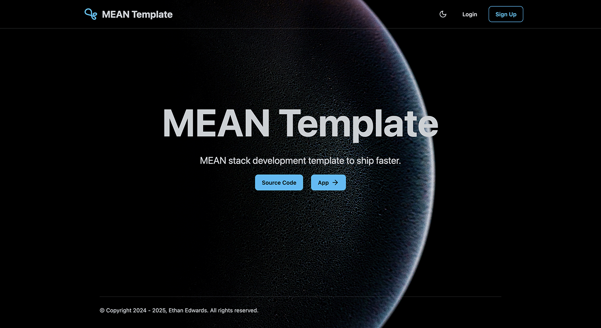

<p align="center">
    <h1 style="text-align: center;">MEAN_Template</h1>
</p>

<p align="center">
   
</p>

<p align="center">
   <b>Modern MEAN stack SaaS template for rapid, scalable, and secure web app delivery.</b><br>
   <i>API, UI, and Infrastructure—modular, cloud-ready, and production-focused.</i>
</p>

---

### Production Demo & Links

- **Live UI:** [https://orange-glacier-050c76b1e.1.azurestaticapps.net/](https://orange-glacier-050c76b1e.1.azurestaticapps.net/)
- **Live API:** [https://mean-app-jtufw3.azurewebsites.net](https://mean-app-jtufw3.azurewebsites.net/api/health)
- **Swagger API Docs:** [https://mean-app-jtufw3.azurewebsites.net/api/swagger/docs](https://mean-app-jtufw3.azurewebsites.net/api/swagger/docs)
- **Documentation Site:** [https://icy-field-05d86561e.1.azurestaticapps.net](https://icy-field-05d86561e.1.azurestaticapps.net)

### Example User Login

```
Username: user@example.com
Password: UserPass123!
```

---

### Screenshots

<div align="center">

**Landing Page**



</div>

<div align="center">

**App Page**


</div>

<div align="center">

**Design Docs Page**


</div>

---

# Overview

**MEAN_Template** is a monorepo boilerplate for SaaS and web applications, optimized for:

- **API-first development** (Node.js, TypeScript, Express, MongoDB)
- **Modern Angular UI** (Angular 19, Tailwind, DaisyUI)
- **Azure-native infrastructure** (ARM templates, CI/CD, Docker)
- **Separation of concerns**: API, UI, and Infra are independently developed, tested, and deployed

> **Why?**
>
> - Ship new SaaS products faster with a secure, scalable, and opinionated foundation
> - Focus on your business logic, not boilerplate
> - Built for real-world cloud deployments, not just local demos

---

## Technology Stack

**Backend (API):**

- Node.js, TypeScript, Express
- MongoDB (Mongoose)
- Passport (GitHub, Google, Local)
- Application Insights, Swagger

**Frontend (UI):**

- Angular 19
- Tailwind CSS, DaisyUI

**Infrastructure:**

- Azure ARM templates (modular, sequenced)
- Docker, Docker Compose
- GitHub Actions (CI/CD)

---

# Quick Start

## Prerequisites

- Node.js 20+
- NPM 9+
- MongoDB (local or Azure CosmosDB)
- Azure account (for cloud deployment)

## Clone & Install

```bash
git clone https://github.com/EthanE96/MEAN_Template.git
cd MEAN_Template
# Install API dependencies
cd api && npm i
# Install UI dependencies
cd ../ui && npm i
```

## Run Locally

### API

```bash
cd api
npm run watch
# or: npm run docker:up (for Docker Compose)
# API: http://localhost:3000/api
```

### UI

```bash
cd ui
npm run watch
# or: npm run start
# UI: http://localhost:4200/
```

### Documentation

```bash
cd docs
mkdocs serve
# Docs: http://127.0.0.1:8000
```

---

## Monorepo Structure

| Folder   | Description                                             |
| -------- | ------------------------------------------------------- |
| `api/`   | Node.js/TypeScript API, Passport, MongoDB               |
| `ui/`    | Angular SPA, Tailwind, DaisyUI                          |
| `infra/` | Azure ARM templates, deployment scripts, Docker compose |
| `docs/`  | MkDocs documentation site                               |

---

## CI/CD & GitHub Workflows

- **API:** Docker image built & published to GHCR on push/tag ([api-build-container.yml](.github/workflows/api-build-container.yml))
- **UI:** Deployed to Azure Static Web Apps on push/PR ([azure-static-web-apps-orange-glacier-050c76b1e.yml](.github/workflows/azure-static-web-apps-orange-glacier-050c76b1e.yml))
- **Docs:** Auto-deployed to Azure Static Web Apps ([azure-static-web-apps-icy-field-05d86561e.yml](.github/workflows/azure-static-web-apps-icy-field-05d86561e.yml))
- **Infra:** ARM templates deployed via GitHub Actions ([arm-deployment.yml](.github/workflows/arm-deployment.yml))

---

## Documentation

**Documentation Site:** [https://icy-field-05d86561e.1.azurestaticapps.net](https://icy-field-05d86561e.1.azurestaticapps.net)

- [Architecture](https://icy-field-05d86561e.1.azurestaticapps.net/architecture)
- [Installation](https://icy-field-05d86561e.1.azurestaticapps.net/installation)
- [Infrastructure](https://icy-field-05d86561e.1.azurestaticapps.net/infrastructure)
- [Reporting](https://icy-field-05d86561e.1.azurestaticapps.net/reporting)
- [Roadmap](https://icy-field-05d86561e.1.azurestaticapps.net/roadmap)

---

## Contributing & Community

Contributions, issues, and feature requests are welcome! Please open an issue or PR.

---

## License

MIT License

Copyright (c) 2025 Ethan Edwards <EthanAEdwards5@outlook.com>

> [License](/LICENSE)

---
