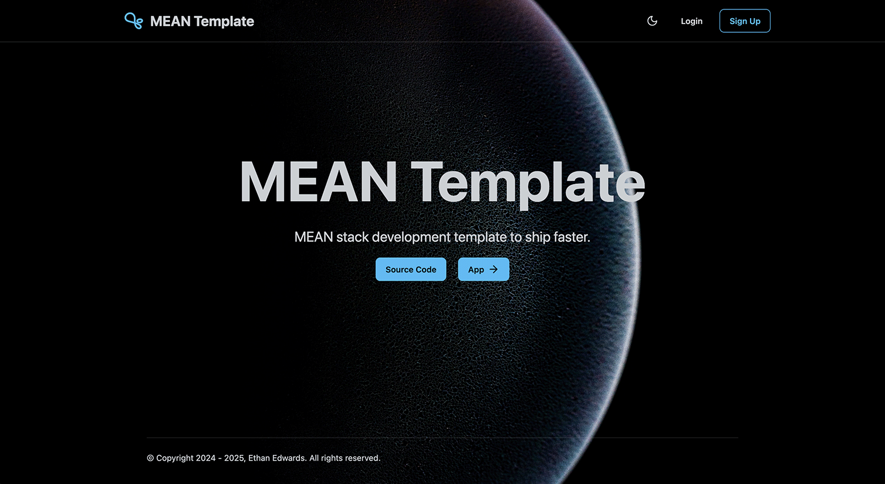

---
hide:
  - navigation
---

## Mean Template

<p align="center">
    <h1 style="text-align: center;">MEAN_Template</h1>
</p>

<p align="center">
   
</p>

<p align="center">
   <b>Modern MEAN stack SaaS template for rapid, scalable, and secure web app delivery.</b><br>
   <i> API, UI, and Infrastructure—modular, cloud-ready, and production-focused.</i>
</p>

---

### Production Demo & Links

- **Live UI:** [https://orange-glacier-050c76b1e.1.azurestaticapps.net/](https://orange-glacier-050c76b1e.1.azurestaticapps.net/)
- **Live API:** [https://mean-app-jtufw3.azurewebsites.net](https://mean-app-jtufw3.azurewebsites.net/api/health)
- **Swagger API Docs:** [https://mean-app-jtufw3.azurewebsites.net/api/swagger/docs](https://mean-app-jtufw3.azurewebsites.net/api/swagger/docs)
- **Documentation Site:** [https://icy-field-05d86561e.1.azurestaticapps.net](https://icy-field-05d86561e.1.azurestaticapps.net)

### Example User Login

```
Username: user@example.com
Password: UserPass123!
```

---

### Screenshots

<div align="center">
   <h4>Landing Page</h4>
   
</div>

<br>

<div align="center">
   <h4>App Page</h4>
   
</div>

<br>

<div align="center">
   <h4>Design Docs Page</h4>
   
</div>

---

# Overview

**MEAN_Template** is a monorepo boilerplate for SaaS and web applications, optimized for:

- **Separation of Concerns**: Clear separation between backend, frontend, and infrastructure
- **Cloud-Native**: Leverage Azure PaaS services for scalability, security, and maintainability
- **Extensibility**: Designed for easy addition of new features and services
- **Security by Default**: Use of managed identities, network security, and best practices
- **Observability**: Built-in monitoring, alerting, and diagnostics
- **Cost Efficiency**: Use of shared plans and free tiers where possible

> **Why?**
>
> - Ship new SaaS products faster with a secure, scalable, and opinionated foundation
> - Focus on your business logic, not boilerplate
> - Built for real-world cloud deployments, not just local demos

---

## Technology Stack

**Backend (API):**

- Node.js, TypeScript, Express
- MongoDB (Mongoose)
- Passport (GitHub, Google, Local)
- Application Insights, Swagger

**Frontend (UI):**

- Angular 19
- Tailwind CSS, DaisyUI

**Infrastructure:**

- Azure ARM templates (modular, sequenced)
- Docker, Docker Compose
- GitHub Actions (CI/CD)

---

## Monorepo Structure

| Folder   | Description                                             |
| -------- | ------------------------------------------------------- |
| `api/`   | Node.js/TypeScript API, Passport, MongoDB               |
| `ui/`    | Angular SPA, Tailwind, DaisyUI                          |
| `infra/` | Azure ARM templates, deployment scripts, Docker compose |
| `docs/`  | MkDocs documentation site                               |

---

## CI/CD & GitHub Workflows

- **API:** Docker image built & published to GHCR on push/tag (.github/workflows/api-build-container.yml)
- **UI:** Deployed to Azure Static Web Apps on push/PR (.github/workflows/azure-static-web-apps-orange-glacier-050c76b1e.yml)
- **Docs:** Auto-deployed to Azure Static Web Apps (.github/workflows/azure-static-web-apps-icy-field-05d86561e.yml)
- **Infra:** ARM templates deployed via GitHub Actions (.github/workflows/arm-deployment.yml)

---

## Documentation

- [Home (Here)](index.md)
- [Installation](installation.md)
- [Architecture](architecture.md)
- [Roadmap](roadmap.md)
- [License](license.md)

---

## Contributing & Community

Contributions, issues, and feature requests are welcome! Please open an issue or PR.

---

## License

MIT License

Copyright (c) 2025 - Ethan Edwards - <EthanAEdwards5@outlook.com>

> [License](license.md)

---
